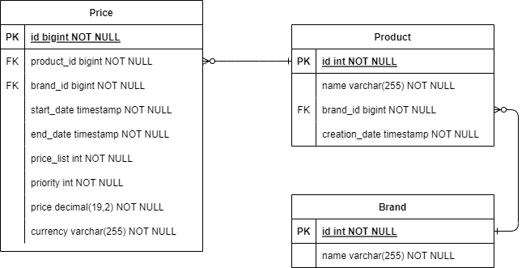

[](https://www.oracle.com/java/technologies/javase-jdk11-downloads.html)
[](https://spring.io/projects/spring-boot)
[](https://maven.apache.org/)
[](https://www.h2database.com/)
[](https://swagger.io/)

# Ecommerce Price Service with Spring Boot
## 📝 Description
This project is a Rest API using Spring Boot that aims to return applicable product prices based on parameters such as product ID, brand ID, and application date.

## 🗄️ Entity-Relationship Model (ERM)
The Entity-Relationship Model (ERM) of the H2 database is shown below:


## 📦 Unified Modeling Language (UML)
The UML diagram of the project is shown below:


## ⚙️ Technologies
- Java 17
- Spring Boot
- Maven
- H2 Database

## ✅ Prerequisites

### Postman
To test the Endpoints, import the Collection and Environments JSON into Postman, which can be found in the following directories:
- `src/main/resources/docs/collections/ecommerce-price-service.postman_collection.json`.

## 📦 Installation
### 1. Extract the project: ecommerce-price-service-main.zip
```bash
  unzip ecommerce-price-service-main.zip
```

### 2. Import the project into your IDE

### 3. Build the project
```bash
    mvn generate-resources
    mvn clean install
```

### 4. Run the project
When you run the project, the application will start and be ready for use.

### 5. Testing the Endpoints
With the collection and environment imported into Postman, you can test the API Endpoints. 
The following Endpoints are available:

##### Endpoint to check if the application is running
- **GET http://localhost:8080/ecommerce-price-service/ping**

#### Endpoint to fetch applicable prices
- **GET http://localhost:8080/ecommerce-price-service/api/prices?productId=35455&brandId=1&applicationDate=2020-06-15-10:00:00**

Use the credentials:

- **Username: admin**
- **Password: admin**

**NOTE:** The credentials can be changed via the environment variables API_USER_NAME and API_USER_PASSWORD, which will default to the standard values if not set

Finally, this endpoint of our API will return a list of applicable prices for the specified product, brand, and date.


### Endpoint to list all products
- **GET http://localhost:8080/ecommerce-price-service/api/products**

### Endpoint to find a product by ID
- **GET http://localhost:8080/ecommerce-price-service/api/products/1**

### Endpoint to list all brands
- **GET http://localhost:8080/ecommerce-price-service/api/brands**

### Endpoint to find a brand by ID
- **GET http://localhost:8080/ecommerce-price-service/api/brands/1**


### 6. Accessing H2 Database
To access H2, go to the URL http://localhost:8080/ecommerce-price-service/h2-console and use the following credentials:

- **Username: sa**
- **Password: password**

**NOTE:** The credentials can be changed via the environment variables DB_USERNAME and DB_PASSWORD, which will default to the standard values if not set.

You will have access to the ecommerce database through the H2 graphical interface.

## 📚 Documentation
The API documentation was done using Swagger and can be accessed through the URL http://localhost:8080/ecommerce-price-service/swagger-ui.html.

The resources folder contains:
- collections: contains the Postman collection and environment.
- api.yml: contains the API documentation in YAML format.
- documentation: contains the API documentation in EMR and UML format.
- db: contains the script for creating and inserting data into the H2 database.